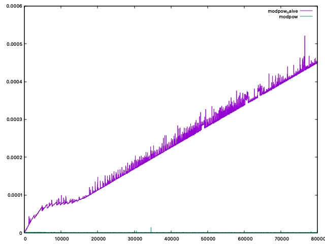
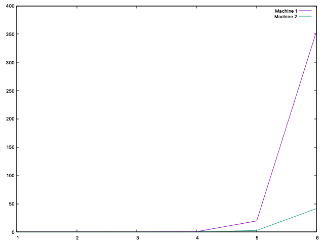

# Rapport Toychain
Le but de ce projet est de créer des outils qui serviront à simuler une élection.

## Compilation
> ! attention : les commandes de test et de build peuvent ne pas fonctionner si il y a des espaces dans le absolute path.
```
make
```
ou clean build
```
make clean
make
```

## Tests

```
make test
```
Pour vérifier les fuites de mémoire :
```
make test VALGRIND=1
```
Pour voir les tests de performance :
```
make test PERFTESTS=1
```
> Il peut être préférable de faire make clean avant de compiler les deux dernières options.


# Choix de structure
- Afin d'avoir une meilleure arborescence nous avons choisit, d'une part de séparer les différents fichiers. Les fichiers définnissant les structures
et les fonctions de manipulation de ces dernières sont présentes dans `/lib`. Tandis que les jeux de tests sont générés dans `/test`. Ca devient vite pratique quand 
on a pleins d'éxécutables.

- Nous avons d'ailleurs choisi d'utiliser __`Doxygen`__, outil très utile pour faire de la documentation. Les fichiers qui permettent de générer la doc sont contenus dans
`/docs`.

- Le projet contient plusieurs fichiers __`Makefile`__, un principal, et d'autres dans différents dossier (`lib` et `test` pour l'instant). Cela nous permet depuis un makefile principal, de
séparer les tâches, mais surtout de pouvoir accéder à des fichiers qui peuvent être contenus dans des dossiers différents. A titre d'exemple, les fichiers de tests font
appel aux fichiers de `lib` lors de la compilation. Ainsi on a une structure très fléxible. Dès qu'on veut rajouter un nouveau fichier, il suffit de le spécifier dans son makefile localement, sans avoir besoin de le donner dans le makefile principal(qui sinon serait trop rempli et illisible). On peut également, grâce à cette structure exporter des variables.
C'est le cas avec le file directory qu'on exporte et qui est accessible par les makefiles des sous-dossiers ou encore la constante `C_INCLUDE_PATH` qui nous permet d'ecrire des chemins absolus a partir de tout fichier faisant partie du projet.

- `/assignement` contient notre rapport et le sujet du projet.

- `/data` contient des fichiers générés lors des tests.

- Pour les tests, nous avons défini dans test.h des fonctions qui vérifient le résultat d'un appel à une fonction.
    + __TEST_SECTION()__ annonce le début d'un jeu de test dont on donne le nom en paramètre.
    + __TEST_SECTION_END()__ annonce la fin du jeu de test en cours.
    + __TEST()__ et __TEST_MSG()__ vérifient si le résultat attendu est bien obtenus par la fonction donnée en paramètre. Dans le cas d'un succès, un compteur de succès est
    incrémenté, sinon un compteur d'échec est incrémenté. A chaque appel à une des 2 fonctions un compteur général est incrémenté.
    + __TEST_SUMMARY()__ fait le bilan du dernier jeu de test : le nombre des tests réussis et échoués.

- Vérification de la présence d'overflow. Dans `overflow.h` on définit des fonctions qui vérifient si une opération(addition, multiplication ...) va causer un dépassement.
 La raison de cette implémentation vient du fait que des entiers trops grands peuvent amener à des mauvaises clés. Ce problème est détaillé dans la partie 1.

- Redéfinition des types standards. On a fait le choix de utiliser nos propres typedef au lieu des types standards. Ce choix vient du fait que nous avons voulou augmenter la taille des entiers pour permettre l'utilisation de plus grandes clés lors du chiffrement. Plus particulièrement , nous avons renommé les types pour les raisons suivantes:
    - Par simplicité, afin de reduire la taille(du point de vue du lecteur) des types. Le type equivalent `uint64` est beaucoup plus lisible que `unsigned long long long ... long int`.
    - (nombre de bits plus clair) le nombre des bits utlisés en mémoire pour chaque type est beaucoup plus facile à lire. En effet ce nombre fait partie du nom du type ce qui par consequent nous evite de verifier la taille d'un `unsigned long int` ou `short int` sur internet et par consequent reduit les erreurs.

- Dans ce projet on utilise des fonctions intermédiaires. C'est le cas pour les fonctions finissant en `_raw`. Ces  dernières ne copient pas les arguments passés en paramètre et permettent directement d'initialiser des objets. Par exemple : `init_protected_raw()` et `init_protected()`. La dernière copie les arguments puis appelle la fonction `raw` pour initialiser.

# Partie 1
Dans cette première partie nous nous intéressons au chiffrement et dechiffrement d'un message à l'aide du protocole `RSA`.
Dans le premier exercice on implémente des fonctions permettant de calculer des nombres premiers dont le test 
de `Miller-Rabin`.
Dans l'exercice suivant, on utilise les fonctions précédentes pour déterminer des clés publiques et privées grâce
à `l'Algorithme d'Euclide`.

## Exercices 1 et 2

### Q1.1
Dans le cas où p est premier, c'est-à-dire le pire cas, la complexité de __`is_prime_naive()`__ est `O(p)`.

### Q1.2
Le plus grand nombre premier qu'on parviens a verifier avec __`is_prime_naive()`__ en moins de `0.002s` est `5279`.
### Q1.3
La complexité de __`modpow_naive(a, m, n)`__ est `O(m)`.

### Q1.5
Pour les 2 fonctions, les temps sont très faibles même pour des grands m.
La courbe de __`modpow_naive`__ est bien lineaire et correspond bien a la complexité de `O(n)`.
La courbe de __`modpow`__ est négligeable devant celle de __`modpow_naive`__ et ne depasse jamais `0.0001s`

Exemple: 

Values (a, m, n)              |modpow_naive |modpow 
------------------------------|-------------|-------
(9435000329, 16, 1093)        |0.000001 sec |0.000001 sec
(160986, 134217728, 25000)    |0.817935 sec |0.000001 sec
(9435000329, 134217728, 1093) |1.491000 sec    |0.000001 sec

> 
> 
> Graphe d'execution de `modpow` et `modpow_naive` pour a = 1234 (la base), n = 667 (le module) et m (l'exposant) de 1 à 8000000 par pas de 10000

> 
> 
> Graphe d'execution de `modpow` et `modpow_naive` pour a = 123456789 (la base), n = 66666 (le module) et m (l'exposant) de 1 à 8000000 par pas de 10000


### Q1.7
Parmi les valeurs de `2` a `p-1`, cad `p-3` valeurs. On a une probabilité de `1/4` de ne pas tomber sur un temoin de Miller.
De plus on effectue le test `k` fois avec remise (la fonction __rand_long__ peut tomber deux fois sur la meme valeur).
Autrement dit la probabilité ne change pas entre les lancers. Donc la probabilité de ne pas tomber sur un temoin de Miller 
pour `k` tests consecutifs est de `(1/4)^k`.

> Rmq: Il serait preferable d'adapter notre fonction de tirage aléatoire pour qu'elle ne répète pas 
> deux fois la meme valeur. Cela augmenterait la probabilité de tomber sur un temoin de Miller à chaque iteration consecutive et 
> par consequent diminuerait celle de faire un faux positif pour un même nombre des tests k. 
> Cependant il se trouve que le gain de cette alteration serait négligeable devant la perte pour l'implementation de la fonction de tirage.

### Jeu de tests
Les sets utilisés pour les tests de chiffrement sont générés aléatoirement. On implémente dans `test/test.h` des fonctions
qui permettent de faires des tests simplements ainsi que `lib/overflow.h` pour detecter des overflows (voir la doc).
Nous avons fournis un assez large set de tests, dont les résultats sont valides. Libre au lecteur de rajouteur ses propres tests. Cela se fait
très simplement avec un appel à __TEST()__ ou tout simplement avec des __printf__.

## Difficultés rencontrées
Nous nous sommes rendus compte, dans la fonction __`generate_key_values()`__, que certaines valeurs générées pouvaient causer
des overflows et ainsi perturber le chiffrement/dechiffrement.

C'est le cas de l'argument `n` de cette même fonction. En effet, si `n` est trop grand, sa multiplication par lui-même peut causer un _overflow_.
Et il en va de même pour le produit de certains nombres modulo `n`.
Par exemple :  `x = (a % n) * (b % n)` _(où `a` et `b` entiers positifs quelconques)_ peut depasser la taille d'un entier.

Le problème vient du fait que n est ensuite utilisé pour l'exponentiation modulaire __`modpow()`__ et peut donc induire un mauvais chiffrement ou dechiffrement. Effectivement, si n a _"débordé"_, l'opération modulo n donnera
un résultat non valide pour notre utilisation. Or n est calculé à partir du produit de `p` et `q`. Donc si `p`, `q` sont trop grands,
`p*q` peut causer un overflow.

Pour empêcher cela, nous avons : 
1. Créé des runtime warnings dans les fonctions de base comme __`modpow_r`__. 
2. Créé des define qui vérifient si une opération entre deux entiers cause un overflow (voir `overflow.h`).
3. Généré un nouveau couple `(p,q)` d'entiers premiers tant qu'un overflow a eu lieu pendant la génération, ie tant que `n = p*q` est trop grand. _(Qu'on vérifie grace aux fonctions dans `overflow.h`)_

Ainsi, on s'assure que le couple `(p,q)` ne cause pas d'overflow et qu'il permet bien de chiffrer/dechiffrer le message.

# Partie 2
Dans cette partie, nous implémentons des structures qui permettront par la suite de générer des intentions de votes. L'un des objectifs est de rendre les déclarations de tous les
participants uniques, de cette façon il devient impossible de voter à la place d'une autre personne sans sa clé secrète (dont on supposera qu'elle n'est jamais transmise).
Ici pas de questions auxquelles répondre, donc on va plutôt faire une présentation de notre code, des choix de structures et des difficultés rencontrées. Et possiblement des tests de performance.

## Exercice 3
Ici sont implémentées 3 structures(et leurs fonctions de manipulation) qui représentent : 
1. Tous les citoyens, ansi que les candidats(1 clé publique et une clé privée) en utilisant une structure __`_Key`__.
2. Les signatures(tableau de `long`), qui permettent d'attester de l'authenticité d'une déclaration. Dont la structure est __`_Signature`__.
3. Des déclarations, contenant la clé publique du votant, un message(clé publique d'un candidat), et une signature. C'est représenté par la structure __`_Protected`__.

### Tests
Les jeux de tests de cet exercice sont disponibles dans `test/rsa.c` et `test/sign.c`.

- `key_to_str()` et `str_to_key()` : les tests sont effectués dans une fonction `test/test_key_str_conversion()`, on vérifie la conversion `Key` -> `string` -> `Key`.
- De même pour `signature_to_str()`, `str_to_signature()` et `protected_to_str()`, `str_to_protected()`.
- On vérifie que la signature est valide avec `verify()` pour laquelle on génère un set aléatoire de clés.


## Exercice 4
Cet exercice est une application directe des fonctions définies dans l'exercice 3. Avec `generate_random_data()`, on simule une élection et on sauvegarde les résultats dans 3 fichiers txt
contenus dans `/temp`.

> Nous avons fait attention à ce qu'il ne soit pas possible qu'un citoyen soit plusieurs fois candidat, ce qui est possible quand on fait plusieurs tirages aléatoires dans une liste.

Nous ferons des tests pour vérifier que la sauvegarde des données s'est bien déroulée dans la partie 3 dans laquelle sont définies des fonctions de lecture.

# Partie 3
Ici on implémente des fonctions de lecture et des structures qui peuvent stocker le contenu des _.txt_ générés précédemment.
Concrètement on à défini des listes chaînées pour les structures ___Key__ et ___Protected__. Lors de la lecture d'un fichier texte. On ajoute en tête d'une liste chaînée
chaque clé lue(après l'avoir convertie en clé bien sur).

## Exercices 5 et 6

### Q6.7 compute_winner
Ici on veut utiliser toutes les fonctions précédentes et celles de manipulation de table de hachage pour simuler une éléction. Pour ce faire,
on dispose dans `./test/vote.c` d'un main qui génère des données avec `generate_random_data()`. Cette partie là ne vérifie pas si le gagnant
retourné est le bon pour le dernier batch généré. En revanche, juste au dessus de cette partie, on met en place un test pour vérifier la 
validité de la fonction. Concrètement, on utilise des votes 'faits main' dont on connait le résultat à l'avance. Ces fichiers texte sont stockés
dans `./test/compute_winner_data`. Comme la tâche est fastidieuse, nous n'avons des fichiers text que pour une simulation seulement, mais le
résultat n'en reste pas moins valide.

### Tests
Dans l'exercice il est demandé de vérifier que `read_public_keys()` puis `print_list_keys()` donnent les mêmes clés que dans `keys.txt`. Faire des tests pour comparer des strings
n'aurait pas beaucoup d'intérêt ici. En effet, pour faire les tests il faudrait redéfinir une autre fonction de lecture qui ferait exactement la même chose que celles demandées, qui
serait alors elle aussi sujet à de potentielles erreurs. De plus les tests de conversions de clés on déjà été effectués plus tôt, le refaire ici serait rendondant. Cependant, en affichant
le résultat de __`print_list_keys()`__ on observe que la lecture puis conversion s'est bien déroulée. Pour s'en convaincre, ces clés sont affichées lors d'un appel à make test.

Pour les `Q5.8` et `Q5.9` dont les fonctions associeés sont `read_protected()` et `print_protected_list()`,
les tests sont présents dans `test/dataio.c`.

# Résumé
Dans ces trois grandes parties nous avons développé des outils qui nous permettent de chiffrer/dechiffrer des messages. Pour cela nous avons utilisé le protocole `RSA` et
les algorithmes permettant de générer des clés publiques et privées. Ces dernières sont l'élément clé _(ahah)_ de notre simulation d'élection car nécessaires quand on veut
créer un message unique et identifiable, de sorte qu'il est impossible d'usurper une autre personne(en considérant que les clés sont gardés bien secrètement).


# Partie 4 et 5 : Blocks et persistance des données
Ici commence l'implémentation de la blockchain. Contrairement au sytème précédent dit centralisé, qui stockait directement toutes les données au même endroit sans aucun intermédiaire, ici on veut constuire un système plus sûr. On veut permettre à n'importe quel citoyen de pouvoir vérifier la validité des déclarations et de les soumettre lui-même. Ainsi chaque citoyen possède une copie de la blockchain, mais la modification est une tâche coûteuse. Ce sytème permet d'empêcher les fraudes, en effet un citoyen seul ne peux pas modifier la blockchain assez rapidement car tous les autres citoyens soumettent continuellement de nouveaux blocks. Or par défaut, on choisit toujours la chaine la plus longue, et le fraudeur, n'a pas le temps de suivre ces mises à jour

## Choix par rapport a la separation de block_to_str

On a choisi de séparer `char* block_to_str(const Block* b)` en deux appels aux fonctions `void block_nonce_to_str(char* headstr, const Block* b)` et `char* block_head_to_str(const Block* b)`. La raison est que cela permet d'optimiser la fonction `void compute_proof_of_work(Block *B, int d)`, notamment cela nous permet de regénerer uniquement la partie du string de Block qui change quand nonce change et par consequent reduire considerablement le temps d'execution d'une itération de la boucle.

### Q7.8

On présente ici un petit test de performance pour la fonction `compute_proof_of_work()`. Voici les résultats de la fonction, éxécutée sur 2 machines différentes :
> remarque : ces résultats sont obtenus en faisant une moyenne. Pour chaque valeur du nombre de zéros, on fait 5 tirages et on sauvegarde la
> moyenne.

nombre des zeros | temps d'executions machine 1 (en secondes) | temps d'execution machine 2 (en secondes) 
-|-|-
1 | 0.000199 s   | 0.000242 s
2 | 0.000636 s   | 0.000138 s
3 | 0.057216 s   | 0.001386 s
4 | 0.692197 s   | 0.164597 s
5 | 19.679282 s  | 2.860631 s
6 | 356.074466 s | 41.651560 s

Enfin, on remarque qu'à partir de 5 zéros, le temps dépasse 1 seconde. Réponse : 5.
Les 2 prochains graphes illustrent les résultats. On remarque bien une augmentation exponentielle du temps d'éxécution, pour 6 zéros le temps augmente considérablement.

>  
>
> Temps d'éxécution en fonction du nombre de zéros.

### Q 8.8
La fonction `CellProtected* fuse_protected_lists(CellProtected* A, CellProtected* B)` est en O(N) où N taille de A
On pourrait avoir une fonction en O(1) si notre liste etait doublement chainee

### Q 9.6

Le code de cette question se trouve dans le ficher `test/question96.c`

### Q9.7
Oui, l'utilisation d'une blockchain est intéressante pour une élection. Elle permet une meilleure transparence sur le processus d'éléction. De plus nous avons vu que la fraude est presque impossible. En revanche les failles ne sont pas inexistantes.

Le probleme avec la blockchain et le systeme de consensus que nous avons utilisé (le proof of work) est qu'il est difficile de choisir le bon nombre de zeros.
- si ce nombre est trop elevée, nous nous limitons a un nombre des votes par seconde tres petit. Cela pourrait causer des problemes notamment pour un systeme de vote. Par exemple, si on prend le nombre des transactions par seconde de bitcoin qui est de 4.6, nous pouvons estimer qu'il faudrait 156 jours à la france pour effectuer une élection.
- au contraire si on diminue de trop le nombre des zeros il sera trop facile de commettre des fraudes pour des groupes malveillantes possedant suffisament de puissance de calcul.

# Conclusion
Quand bien même, lors de ce projet, nous avons eu l'occasion d'expérimenter de nouvelles choses, d'apprendre de nouveaux concepts, et de sortir un peu la tête des livres de cours.
